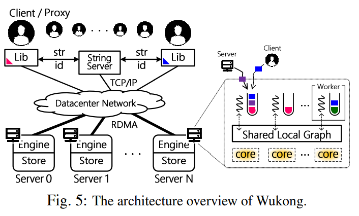

Basic Information
----
* Title: Fast and Concurrent RDF Queries with RDMABased Distributed Graph Exploration
* Author:Jiaxin Shi, Youyang Yao, Rong Chen, and Haibo Chen, IPADS in SJTU; Feifei Li, University of Utah
* Publication: 16-osdi

Overview
----
wukong是一个用于查询RDF信息的系统，使用的是SPARQL语句。为了保证更好的图的局部性，他允许数据冗余，即将图的一些边复制到不同的server上。wukong的架构如下图所示：
\
### Architure
wukong在server端使用的是非中心化的设计。wukong分为proxy thread和engine thread，proxy负责跑命令行、以及负责调度平衡查询，engine负责执行查询操作并且返回给proxy.\
wukong使用了subject/predicate/object的映射（被称为string_server)，以便减少在数据传输时由于数据太长而造成的网络压力。每个server分为query engine和graph store层，graph store层使用的是基于chaining hashtable的KV-store，query engine则是绑定CPU不同的核来支持查询。
### Query Processing
proxy根据查询类型决定查询将被送到哪个server上，比如针对固定点的查询即(subject/object不是查询对象)，则将其送到特定的server上，而不确定的查询则将其分发到所有的server上进行查询。\
此外，wukong还将查询解析为一个operator tree，每个query都对应着一些小的sub-query，每个server处理一些sub-query，如果有必要还会将这些sub-query分发到其他的server上进行查询（发送到task queue然后异步执行）

Graph-based RDF Data Modeling
---

### Graph Models and Indexes
wukong将RDF数据分为两种index，normal index指的是subject/object，而predicate也具有index，并且wukong利用这些index来作为划分标准。（具体是用hash）

### Differentiated Graph Partition
刚才说到了wukong是根据index来作为图的划分标准，而不是像传统的系统一样使用的是图结构（比如针对同一节点按照度数进行划分），这是因为这样很好地保证了图的locality，并且如果使用的是基于图结构的划分，很容易会造成这样一种现象：比如一个查询进来，你会发现这个查询很容易和他在图中相邻的节点有关，这样会导致查询的不平衡。因此采用的是基于index的划分。

### RDMA-friendly Predicate-based Store
刚刚说过了wukong存储的图是一个KV-store，他包括了normal KV和index KV。
对于normal KV，不同于之前使用的是subject/object的vid作为key，wukong使用的是\<vid,t\/pid,DIR\>作为key。这是基于很多查询其实是给定了predicate的，也就是predicate不是作为查询对象存在的（比如 \<?X predicate Y\>)。除此之外，wukong使用了特定的t/pid作为TYPE_ID和PREDICATE_ID针对这样的key，即\<vid,TYPE_ID/PREDICATE_ID,DIR\>他的value是所有的tid和pid。给定vid的特定方向，有哪些predicate和type。\
针对index KV pair，他预留了vid为0表示这是index的KV，他实际上存储的是特定predicate/type的所指向的vid。\
此外wukong使用的KV-store是DrTM-kV（chaining hashtable），这个可以看文章中的引用[48].

Query Processing
----

### Basic Query Processing
对于predicate已知的情况，wukong以predicate为索引，找到满足限制条件的subject/object并且join。对于predicate未知的情况，wukong通过\<vid,PREDICATE_ID,DIR\>为索引遍历所有的predicate然后寻找满足条件的object/subject。（所以predicate未知的时候还是比较慢的？）

### Full-history Pruning
查询的瓶颈往往在于不同server最终的final join上，由于RDMA-write/read在传输数据较小时(\<4k)差别并不大，因此wukong选择的是每一步都join，从而修剪掉一些不必要的sub-query.这样也可以在之后的join中减少网络传输。此外如果传输的信息过大，wukong还可以自适应的退回到一步one-step pruning，不过测试中并没有出现这样的情况。

### Migrating Execution or Data
查询时，如果需要fetch remote server的少部分节点，则采用in-place模式，如果需要使用到remote server的大量节点，则使用fork-join模式，每个子查询也可以这样递归的执行下去，且每个server都有独立决定哪个模式的能力。此外如果针对某些predicate的查询量太大，则会强制使用fork-join模式。

### Concurrent Query Processing
对于每个server来说都有一个private的队列(FIFO)来控制查询，wukong允许worker-obliger机制来窃取查询，他给每个查询限定了一个时间戳，如果时间大于了这个时间戳还没有进行这个查询，那么就把这个查询偷过来查询，这一定程度上满足了负载平衡。

Experiments
---
实验部分图太多了就不赘述了...

Summary
---
16osdi-wukong是我看的第一篇关于系统的文章，我也看了部分实现的源代码，但是没有看完，特别是query的部分，所以有些地方可能描述的不对/不准确，希望交流指正。